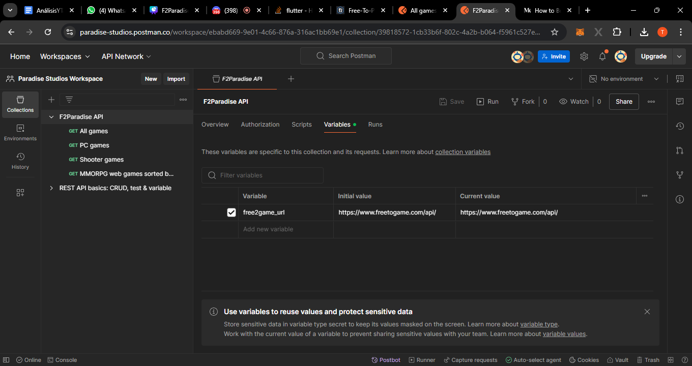
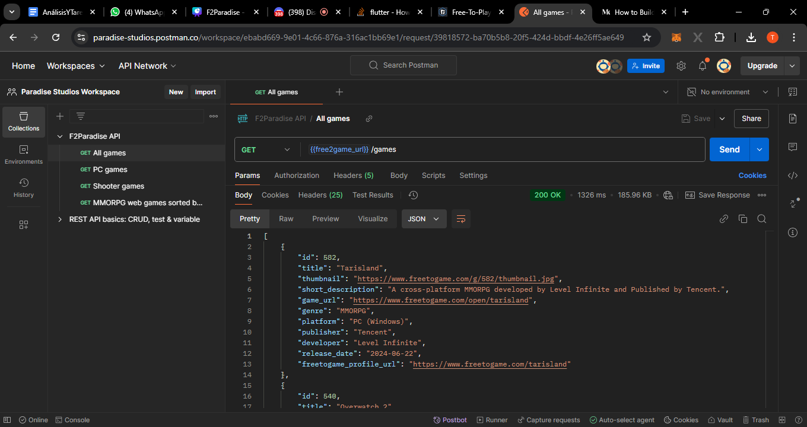
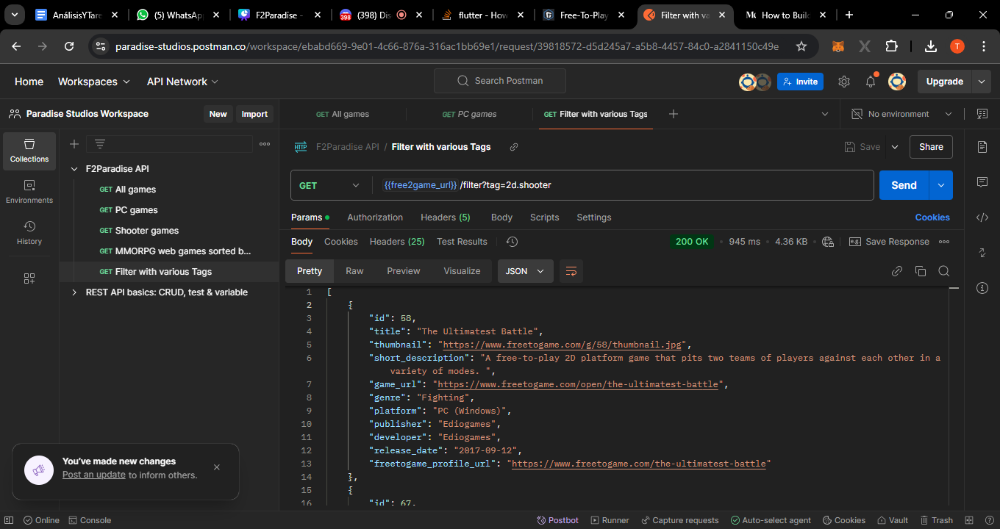

# APITEST

## Introducción

En el siguiente documento se pueden encontrar las pruebas realizadas en Postman con la API de [freetogame](https://www.freetogame.com/api-doc) que se utilizó para extraer juegos gratis desde la web. 

La API consta únicamente de solicitudes tipo GET para obtener distinta información de su base de datos, utilizando filtros, tags y sistemas de ordenamiento.

## Pruebas

Para realizar las solicitudes a la API, utilizamos esta dirección url.

La primera prueba que realizamos fue intentar traer todos los juegos.

Y posterior a eso experimentamos haciendo uso de los tags, puesto que, a pesar de que los juegos poseen un parametro `genre`, las opciones de tag eran mucho más variadas, trayendo también más agrupaciones distintas de juegos. Esta llamada en específico fue principalmente utilizada en la pantalla Search, a la hora de realizar búsquedas con filtros (los mismos tags).
